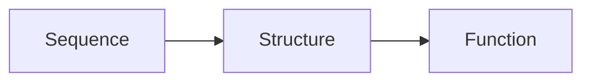

#### Synopsis
In molecular biology, the common information flow is accepted as: 

The authors of this paper claims that an unsupervised learning method on sequence alone is able to make predictions on structure and functions. These significant claims. It was published before AlphaFold or ESMFold. We cannot expect precise structure prediction, but they say that homology predictions, secondary structure predictions and mutational effects are the ones which they were able to predict. 

What to watch out for: 
- Which model did they use? My guess is mostly transformers. 
- What was the training data. How did the model get the input, and what was the output computed on? 
- Scope of the paper 

## Concepts
[[Distributional Hypothesis]]
[[Perpexity]]
[[Homology]]: Shared ancestry
[[Interpreting performance of language models]]
## Methods
- Trained on UniParc database
- Modelling performance measured as a function of sample diversity
- [[Perpexity]] used as a metric to evaluate different models
- Different models tested included the [[Transformers]], [[LSTM]] 

#### Evaluating structural representations 
- Dimensionality reduction achieved through [[t-SNE]] mostly
- To understand whether the model has learnt biological properties of different amino acids (N=25), they projected the output weight matrix  (25x1208 mat) down to two-dimensions (25x2) using [[t-SNE]]
##### Does the model learn similar structural features? 
	- They performed mean-pool representation of a protein by averaging the output embeddings across all residues. Thus each protein is represented by a single point in the embedding space (1208-D). 
	- Project the protein representation down to 2-D and observe clustering
	- Color the proteins based on [[Orthologs]]
	
##### Does the model learn remote [[Homology]]? 
	 - They get protein domains from the [[SCOPe]] directory which classifies protein domains as
	```mermaid
	graph RL
	  A[Fold] --> B[Superfamily] --> C[Family] --> D[Protein domains]
	```
	
	- Take each domain from the [[SCOPe]] directory, and obtain the output [[embeddings]]. 
	- For each point in the embedding space, search how many true entries are present near it. If the model has learnt true representation of Fold and Superfamily, then those domains which share the same fold or superfamily gets clustered together
	
	
##### Secondary structure prediction and contact prediction
- Train a linear probe on the output embedding of the transformer. Do it so that for each residue position, the linear probe maps it from 1280 (embedding dimension) to 8 (8-class secondary structure labels from DSSP). 
- $$SSE_i = softmax(W @ y_i + b)$$ (for a residue at position i)
- Use the same probe for testing and compute accuracy measures 
- Baseline for comparison: Using MSA that traditional methods have used (HHMPred)
- For contact prediction: take the two output embeddings of the transformer. Linearly project them down. Compute dot product between them. Does this dot product relate to whether or not the pairs of residues are in contact? 
## Evidence

### Performance of transformer models
- Perplexity for a transformer model trained on the same dataset was lower compared to a slightly larger LSTM model
- Bigger the transformer size, the better. 
- Best model had perplexity of 8.46 for 669.2 million model 
![[Pasted image 20260606105632.png|447]]
- 
### Multi-scale organisation in sequence representation in transformers
#### Projections of output [[embeddings]] using [[t-SNE]] group sequences based on biological property
![[Pasted image 20260606121212.png|477]]

#### Learned projections find remote homologs as good as the state of the art HHBits 
![[Pasted image 20260606142400.png|485]]

Note that the results do not scale very well, showing some counter-intuitive properties. The smallest Transformer model is better than the largest one at finding atleast one real entry in its 10 NN. ESM-1b model also not the greatest, and the different hyperparameter tunings have changed the properties. 

### Transformers learn structural representations better than methods relying on evolutionary history
![[Pasted image 20260606164641.png|442]]
Pretraining helps. A transformer without pre-training does not recover proper secondary structure features. This shows that the linear probe is not imposing any bias. 
![[Pasted image 20260606164752.png|471]]
Contact prediction
![[Pasted image 20260606165029.png]]

#### Training on one family of structures do not generalize well to structures from other families

Used 12-layer transformer model trained on one protein family (say kinases). Then predicting on structures from other families. Training on kinases results in best scores for test structures from kinase families. But training on representative dataset from UniParc beats even models trained on same families. 

Using ATP-binding domain of the ABC transporters (PF00005), Protein kinase domain (PF00069), and Response regulator receiver domain (PF00072)
![[Pasted image 20260606170248.png]]
## Conclusion

This paper directly deals with the question of what a transformer model actually learns when it is trained on a language model objective on protein sequences. They employ a transformer architecture trained on 250 million sequences. The primary methods they use to study the structural representation is visualisation through dimensionality reduction (using [[t-SNE]]) and distance based measures for quantifying accuracy of structural representation. 

They find that primarily, a transformer was better at modelling sequences than LSTM architectures. They showed lower [[Perpexity]] of around 8.4 for the largest transformer models they trained. 

The interesting results from this paper is not just that it can model sequences, but how it does it. They show through standard mechanistic interpretability techniques that a transformer model has learnt some structural features in its representations. 

- They show that final weight matrix clusters amino acids based on biological properties 
- Mean-pooling embeddings across residues result in a high-dimensional representation of a protein which clusters domains of similar homology together
- These mean-pooled representations of a protein structure are as good at finding remote homologs as the current best state of the art tool which employs MSA
- Output embeddings at each residue can be linearly mapped into 8-class secondary structure labels with a common weight matrix. Further, these structural features are learned through pre-training since the linear probe on an untrained transformer is not able to pick these signals. 
- Similar linear projections of residue-level embeddings can be used to detect contacts at the level of state of the art models.
- Interestingly, secondary structure prediction from a transformer trained on one protein family does not generalise as well to structures from another protein family, or to a model trained on representative dataset. Although the final point needs to be cautioned because we do not know the number of training examples used for each model, and the results will be valid once they are set constant. 
They also show that learned embeddings also transfer well to other models for better prediction of secondary structures and contact predictions. 

Their results also show that the network is still underspecified. Perplexity during training is a good indicator of structure representation and for the 1b model it was still not saturated. 
