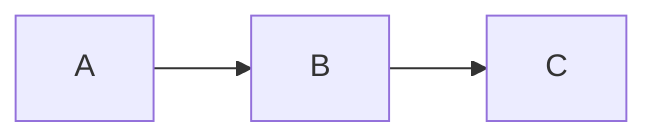

---
year:
tags:
  - ai
  - protein_language_models
link:
  - https://www.nature.com/articles/s41592-026-03028-7
architecture_class:
training_size:
dataset:
architecture_params:
---
#### Synopsis

## Concepts

## Methods

#### Method - 1 
- 

##### Method - 2

## Evidence

### Result 1
- 
### Result 2
#### Sub-result 1

## Conclusion

### Useful blocks

- $$y = f(W \cdot x + b)$$