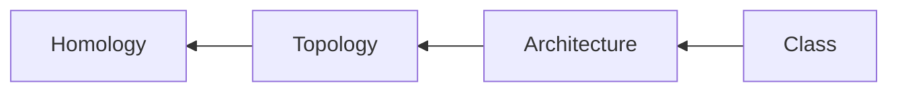

---
aliases:
tags:
  - ai
  - genetics
  - protein_structure
related:
  - sc
---

## What is it? 🤔

Protein structure classification 

	
## Where I learnt this 🕶
[[Protein design using ProteinMPNN]]

## Example application 💡