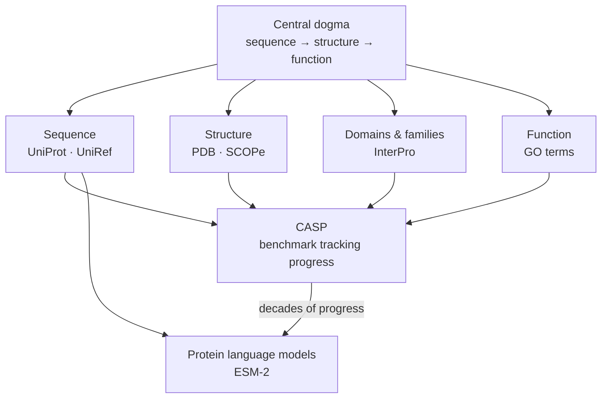
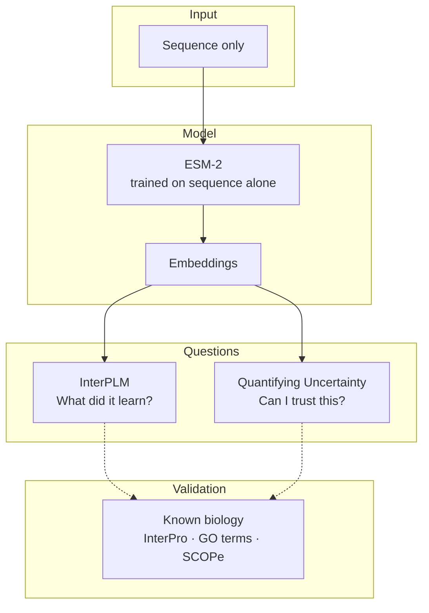

### Progression

### What the papers ask


# Papers 
[[InterPLM discovering interpretable features using Sparse AutoEncoders]]
[[Quantifying Uncertainty of protein representations]]

### All concepts
```dataview
TABLE without ID 
	file.link AS "Concept",
	one_line AS "One line definition"
FROM "2_Concepts"
SORT tags ASC
```

### All interesting bits!
```dataviewjs
const folder = "1_Literature";    // folder to search; "" = whole vault
const only = "interesting";     // label to find; "" = all code blocks

const re = /^(`{3,}|~{3,})[ \t]*([\w-]*)[^\n]*\n([\s\S]*?)^\1[ \t]*$/gm;
const pages = folder ? dv.pages(`"${folder}"`) : dv.pages();

for (const p of pages.sort(p => p.file.name)) {
  const text = await dv.io.load(p.file.path);
  const blocks = [...text.matchAll(re)]
    .filter(m => m[2] !== "dataviewjs" && (!only || m[2] === only));
  if (!blocks.length) continue;
  dv.header(3, p.file.link);
  for (const m of blocks) dv.paragraph("```" + m[2] + "\n" + m[3] + "```");
}
```