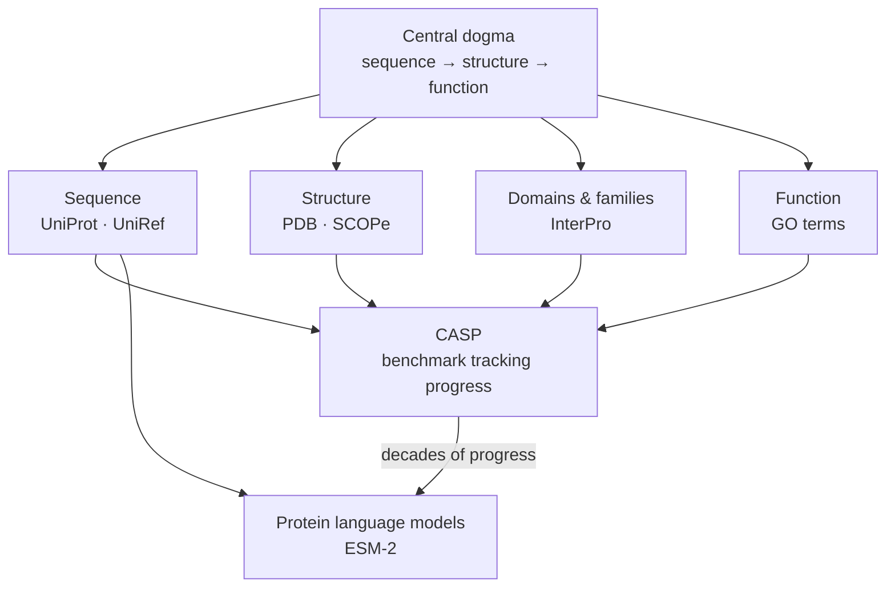
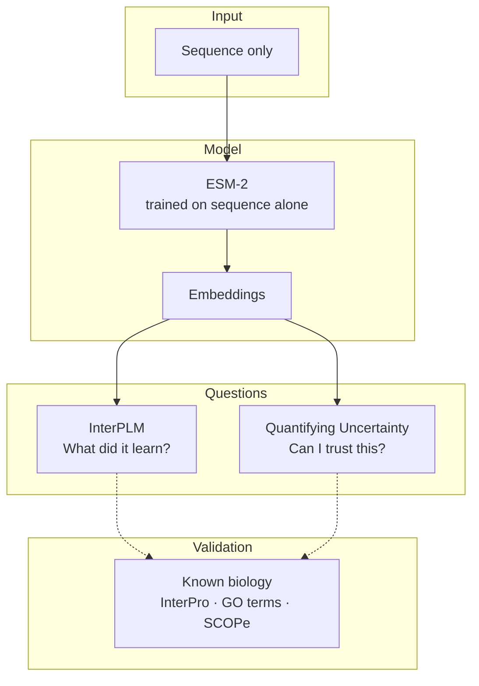

### Progression

### What the papers ask


# Papers 
[[InterPLM discovering interpretable features using Sparse AutoEncoders]]
[[Quantifying Uncertainty of protein representations]]

### All concepts
```dataview
TABLE without ID 
	file.link AS "Concept",
	one_line AS "One line definition"
FROM "2_Concepts"
SORT tags ASC
```

