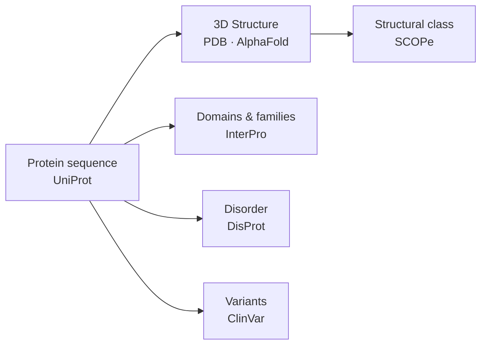
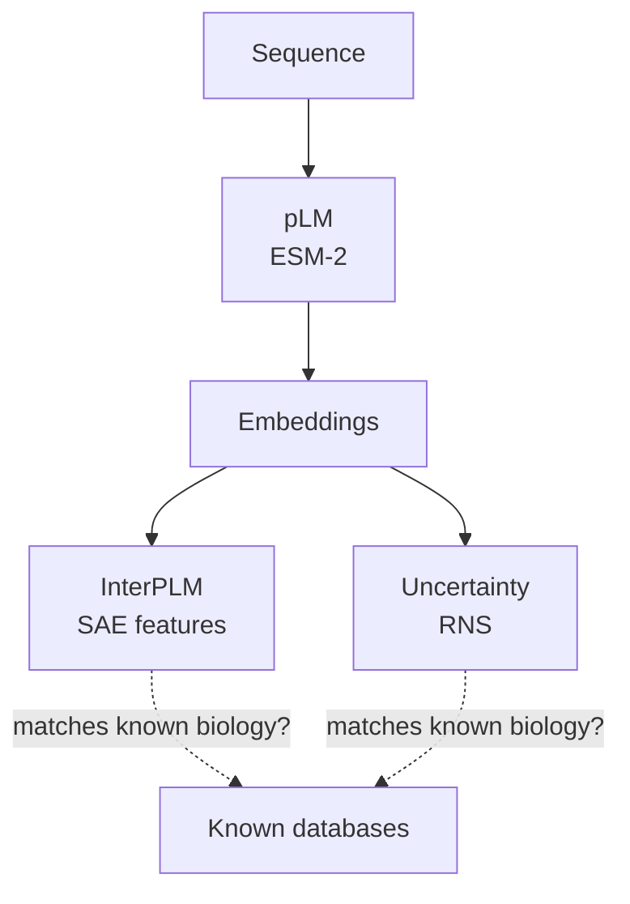

### What exists

```mermaid
graph LR
    P[Protein sequence\nUniProt] --> S[3D Structure\nPDB · AlphaFold]
    P --> F[Domains & families\nInterPro]
    P --> D[Disorder\nDisProt]
    P --> V[Variants\nClinVar]
    S --> C[Structural class\nSCOPe]
```

### What the papers ask

```mermaid
graph TD
    P[Sequence] --> pLM[pLM\nESM-2]
    pLM --> E[Embeddings]
    E --> SAE[InterPLM\nSAE features]
    E --> U[Uncertainty\nRNS]
    SAE -.->|matches known biology?| K[Known databases]
    U -.->|matches known biology?| K
```
