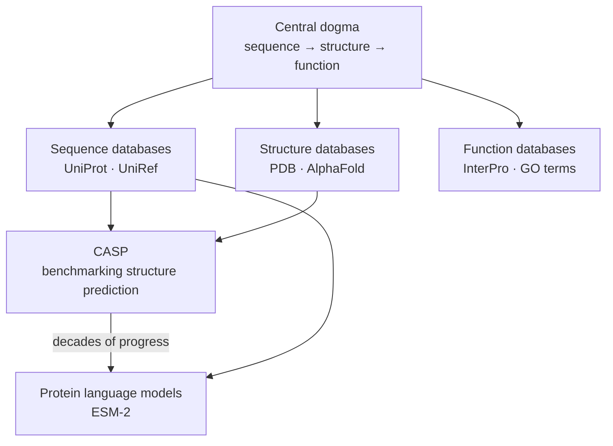
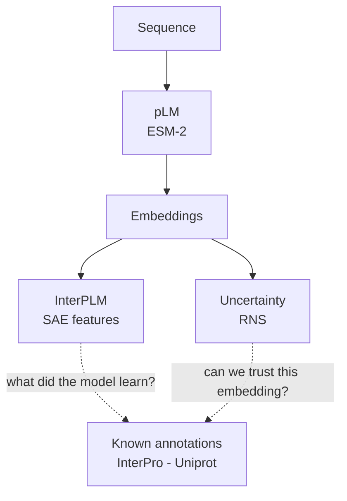

### Before times

**Concepts in this diagram:** [[CASP]] · [[homology]] · [[protein families]] · [[intrinsic disorder]] · [[bioinformatics]] · [[SCOPe]]

### What the papers ask

**Concepts in this diagram:** 
[[ESM-2]] · [[embeddings]] · [[sparse auto encoders]] · [[random neighbor score (RNS)]] · [[mechanistic interpretability]]